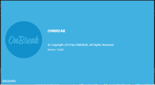
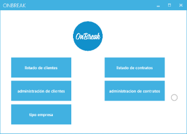
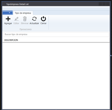

 

    

# OnBreak

---
### 🇪🇸 Español:
Aplicación de escritorio para la gestión de clientes y contratos de la empresa de eventos empresariales OnBreak.

### Funcionalidades:

- **Administración de Clientes:** Crea, modifica y elimina clientes.
- **Administración de Contratos:** Crea, modifica y elimina contratos.

### Tecnologías utilizadas:
Se desarrolló en el framework .NET usando el lenguaje C# y una base de datos Oracle.

 &nbsp;&nbsp;
 &nbsp;&nbsp;
 &nbsp;&nbsp;

### Diseño:
Se usó como guía el estilo Metro (también conocido como Modern UI), que produce interfaces modernas y con características visuales interesantes y atractivas, tomando en cuenta la imagen corporativa de la empresa.

---
### 🇬🇧 English:
Desktop application for managing clients and contracts of the corporate events company OnBreak.

### Features:

- **Client Management:** Create, modify, and delete clients.
- **Contract Management:** Create, modify, and delete contracts.

### Technologies Used:
Developed on the .NET framework using the C# language and an Oracle database.

 &nbsp;&nbsp;
 &nbsp;&nbsp;
 &nbsp;&nbsp;

### Design:
The Metro style (also known as Modern UI) was used as a guide, producing modern interfaces with interesting and visually appealing features, while considering the company's corporate image.

---
## Capturas de Pantalla / Screenshots

 
 
&nbsp;&nbsp;
 
1 - Splash Screen (on loading)
 
 
 
&nbsp;&nbsp;
 
2 - Main Screen
 
 
 
&nbsp;&nbsp;
 
3 - CRUD for Businesses
 
 
 

